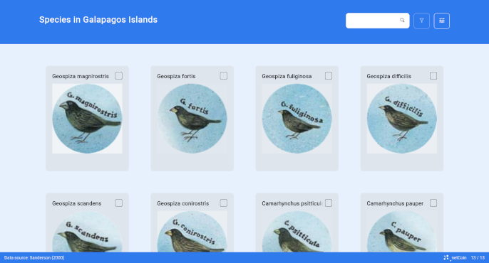

# Connected Image Galleries

## Description

The `netCoin` package represents and manages information from an image database with attributes that hierarchically connect them.

Components:

- **Images:** Images.
- **Information:** Table, Name, Tooltip, Information Window.
- **Utilities:** Image Search, Filter, Display Customization, Bar Charts.

## Examples

Load the pakcage
```{r}
library(netCoin)
```

A simple gallery representing finches species in Galapagos Islands
```{r message=FALSE, warning=FALSE}
data("finches")
finches$species <- system.file("extdata", finches$species,
             package="netCoin") # copy path to the species field
finches$attribution <- c(
  "2009 - Peter Wilton",
  "2007 - putneymark",
  "2007 - putneymark",
  "2012 - Joseph C Boone",
  "2007 - putneymark",
  "2007 - putneymark",
  "2013 - Simon J. Tonge",
  "2009 - Paul McFarling, Charles Darwin Foundation",
  "2009 - Mike Comber",
  "2014 - Lip Kee",
  "2006 - User:BBODO on english wikipedia",
  "2010 - Michael Dvorak",
  "2000 - Paul McFarling, Charles Darwin Foundation"
)
# You can specify the column with image paths trough the 'image' parameter
g <- gallery(finches, image="species", imageCopy="attribution",
  main="Species in Galapagos Islands", note="Data source: Sanderson (2000)")
plot(g)
```

```{r echo=FALSE}

```

The same gallery with another theme
```{r message=FALSE, warning=FALSE}
g <- exhibit(finches, image="species", imageCopy="attribution",
  main="Species in Galapagos Islands", note="Data source: Sanderson (2000)")
plot(g)
```

```{r echo=FALSE}

```

Connected image gallery
```{r message=FALSE, warning=FALSE}
# tree of relations between items
tree <- data.frame(
  shape = c("circle","triangle","square"),
  color = c("circle_red|circle_green|circle_blue",
    "triangle_red|triangle_green|triangle_blue",
    "square_red|square_green|square_blue")
)

# specify images for items
nodes <- list()
nodes$shape <- data.frame(name=c("circle","triangle","square"))
nodes$shape$image=system.file("extdata", paste0(nodes$shape$name,".svg"),
      package="netCoin")
nodes$color <- data.frame(name=c("circle_red","circle_green","circle_blue",
    "triangle_red","triangle_green","triangle_blue",
    "square_red","square_green","square_blue"))
nodes$color$image=system.file("extdata", paste0(nodes$color$name,".svg"),
      package="netCoin")

# create gallery
g <- netExhibit(tree, initialType="shape", tableformat=TRUE,
  nodes=nodes, image="image")
plot(g)
```

```{r echo=FALSE}

```
