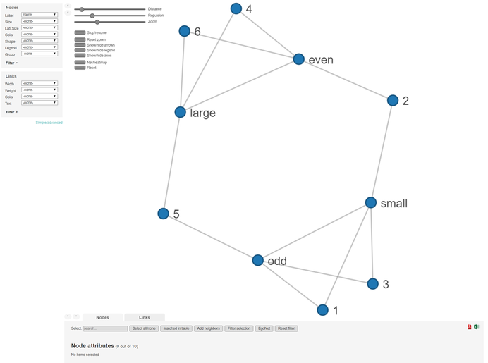
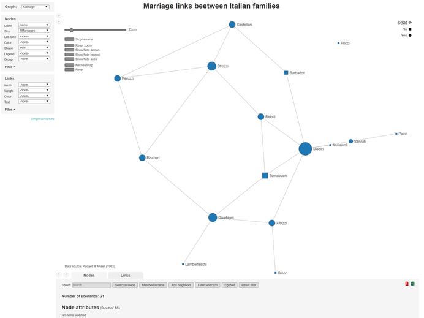
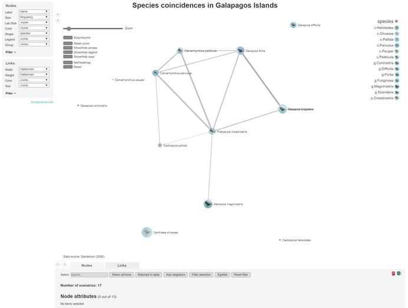

netCoin creates interactive networked graphs of coincidences within the data. It brings together the data analysis capabilities of R with powerful interactive visualization JavaScript libraries to provide a package to study coincidences.

This vignette briefly describes the statistical methods and provides a few examples on how to use the package. The sections are structured as follows:

1. **[Definitions](#def) **
2. **[Introduction and examples](#examples)**
  + [Package installation and loading](#inst) 
  + [Basic coincidence analysis with dice roll data](#basic) 
  + [Multigraph coincidence analysis with data of families of Renaissance Italy](#multi) 
  + [netCoin applied to Sanderson's analysis of species co-ocurrences](#sanderson) 


## <a id="def">Definitions</a>
Coincidence analysis is a set of techniques to detect events, characters, objects, attributes, or characteristics that tend to occur together within certain delimited spaces.

These spaces are call scenarios ($S$) and are considered to be the units of analysis, and as such they have to be placed in the rows of a matrix or data.frame.

In each $i$ scenario, a series of $J$ events $X_j$, which are represented as dichotomous variables $X_{j}$ in columns, may occur (1) or may not occur (0). Scenarios and events constitute an incidence matrix $\mathbf{I}$.
$$\mathbf{I}=
\begin{pmatrix}
0&1&0&...&1 \\
1&0&1&...&0 \\
...&...&...&...&... \\
1&1&0&...&0
\end{pmatrix}$$

From this incidences matrix, a coincidence symmetric matrix ($\mathbf{C}$) can be obtained with the `coin` function \code{\link{coin}}. In this matrix the main diagonal represents frequencies of $X_j$, while the others elements are number of coincidences between two events.

$$\mathbf{C}=
\begin{pmatrix}
2&1&1&...&1 \\
1&2&0&...&2 \\
1&0&1&...&0 \\
...&...&...&...&... \\
1&2&0&...&2
\end{pmatrix}$$


Once there is a `coin` object, a similarity matrix can be obtained. Similarity matrices available in netCoin are:

* Matching, Rogers \& Tanimoto, Gower, Sneath and Anderberg.
* Jaccard, dice, antiDice, Ochiai and Kulczynski.
* Hamann, Yule, Pearson, odds ratio and Rusell.

In addition to the previous, other measures that can be obtained from `coin` are:

* Relative frequencies, conditional frequencies, coincidence degree, and probable degree of coincidence.
* Haberman and Z value of Haberman

To obtain similarity and other measurement matrices, the function `sim` elaborates a list of them.
<div style="text-align: right">
Haberman |odd | even | small | large
------------- | ------------- | ------------- | ------------- | -------------
odd           |     10.000000 |    -10.000000 |    4.766506   |   -4.766506
even          |    -10.000000 |     10.000000 |   -4.766506   |    4.766506
small         |      4.766506 |     -4.766506 |   10.000000   |  -10.000000
large         |     -4.766506 |      4.766506 |  -10.000000   |   10.000000
</div>

The function `edgeList` generates a collecion of edges composed by a list of similarity measures whenever a criterium (generally p(Z)<.50) is met.


Source | Target | Haberman | P(z)
------------- | ------------- | ------------- | -------------
odd  | small | 4.766506 | 3.18645e-06
even | large | 4.766506 | 3.18645e-06


In order to make a graph, two data frames are needed: a nodes data frames with names and other nodes attributes (see `as.nodes` and an edge data frame (see `edgeList`). For more information go to [netCoin](https://cran.r-project.org/package=netCoin).

## <a id="examples">Examples</a>
### <a id="inst">Package installation and loading</a>

To install and load the updated version of the netCoin package simply run the following commands:
```{r eval=FALSE}
install.packages("netCoin")
```
```{r echo=TRUE, message=FALSE, warning=FALSE}
library(netCoin)
```
### <a id="basic"> Basic coincidence analysis with dice roll data</a>

Once the netCoin package has been installed and loaded, let's now load the dice data and have a look at it:
```{r echo=TRUE}
data(dice)
head(dice)
```

It contains the results of rolling a dice 100 times. The scenarios here are each dice roll. The events are the possible results, i.e. each of the numbers from 1 to 6 as well as odd or even and small(<4) or large(>3). Thus the first column contains the numeric result, the following 6 columns represent each of the dice roll possible outcomes with 1's and 0's. Finally, the last four columns also contain 0's and 1's for representing whether the result is odd or even, small  or large.


Columns 2 to 11 can be considered the incidence matrix $\mathbf{I}$
```{r echo=TRUE}
head(dice[,-1])
```

Using the `coin` function the coincidence matrix $\mathbf{C}$ can be obtained:
```{r echo=TRUE}
C <- coin(dice[,-1]) # coincidence matrix
C
```

The nodes and edges can be calculated from the coincidence matrix $\mathbf{C}$ and then the network object can be generated 
```{r eval=FALSE}
N <- asNodes(C) # node data frame
E <- edgeList(C) # edge data frame
Net <- netCoin(N,E) # network object
```

The network to be visualised is created using the following command which generates a folder with an **index.html** file to open with a browser that will display the interface shown below:
```{r eval=FALSE}
Net <- netCoin(N,E,dir="dice")
```


```{r echo=FALSE, out.width='98%'}

```

### <a id="multi"> Multigraph coincidence analysis with data of families of Renaissance Italy</a>

The following example uses data about families of Renaissance Italy from Padgett & Ansell (1983). It consists of a dataframe (families) with information about italian families of the renaissance, and another dataframe (links) with the marriage and business links between families.

```{r}
data("families")
data("links")
```

The previous `coin`, `edgeList`, `asNodes` and `netCoin`  functions can be executed together with the `allNet` function where several parameters can be specifyed:

* incidence - a dataframe that contains the incidence matrix.
* nodes - a dataframe with at least one vector of names.
* layout - the algorithm selected for the network topology.
* criteria - the statistical criteria to be used for the strentgh of the edges.
* minL - minimum value of the statistic to represent the edge in the graph.
* size - name of the vector with size in the nodes data frame.
* color - name of the vector with color variable in the nodes data frame.
* title - upper title of the graph.
* subtitle - lower title of the graph.

With the following commands two networks are generated that represent on the business and marriages links between the two families.

```{r message=FALSE, warning=FALSE, eval=FALSE}
G <- allNet(incidence=links[links$link=="Marriage",-17],
     nodes=families, layout="md", percentages= FALSE,
     criteria="f",minL=1, size="f.Marriages",shape="seat",
     main="Marriage links beetween Italian families",
     note="Data source: Padgett & Ansell (1983)")
H <- allNet(incidence=links[links$link=="Business",-17],
     nodes=families, layout="md", percentages= FALSE,
     criteria="f",minL=1, size="f.Business",shape="seat",
     main="Marriage links beetween Italian families",
     note="Data source: Padgett & Ansell (1983)")

```

Once the two networks are ready, the function `multigraphCreate` generates both graphs in the specified file.

```{r echo=TRUE, message=FALSE, warning=FALSE, eval=FALSE}
multigraphCreate(Marriage=G,Business=H,dir="italian")
```

```{r echo=FALSE, out.width='98%'}

```

### <a id="sanderson"> netCoin applied to Sanderson's analysis of species co-ocurrences</a>
This section uses one of the most renowned data examples in ecology. Charles Darwin compiled data about 13 species of finches and where they could be found in 17 of the Galapago islands. Sanderson ....

Here we add a few extra features to our graph:

* criteria="hyp" -  the statistical criteria to be used for the strentgh of the edges .
* maxL=.05 - maximum value of the statistic to include the edge in the list.
* lwidth ="Haberman" - name of the vector with width variable in the links data frame.
* lweight="Haberman" - name of the vector with weight variable in the links data frame.
* image="file" - name of the vector with image files in the nodes data frame.
* layout="mds" - the algorithm selected for the network topology.


```{r echo=TRUE, message=FALSE, warning=FALSE, eval=FALSE}
data("Galapagos")
data("finches")
finches$species<-system.file("extdata", finches$species,
        package="netCoin") # copy path to the species field
Net<-allNet(Galapagos,nodes=finches, criteria="hyp", maxL=.05,
        lwidth ="Haberman",lweight="Haberman",
        size="frequency", image="species", layout="mds",
        main="Species coincidences in Galapagos Islands",
        note="Data source: Sanderson (2000)")
plot(Net)
```

```{r echo=FALSE, out.width='98%'}

```
